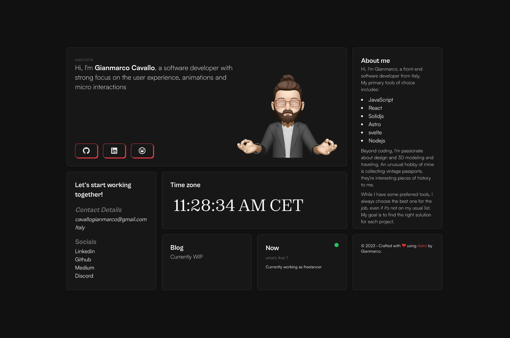

# ⚡️astro-bento-portfolio

## A personal portfolio website made using `Astro`.



To view a demo example, **[click here](https://sparkly-speculoos-0c9197.netlify.app/)**

or my portfolio **[click here](https://gianmarcocavallo.com)**

## Features

- Modern and Minimal bento-like, sleek UI Design
- All in one page (almost)
- Fully Responsive
- Performances and SEO optimizations
- Ready to be deployed on [Netlify](https://www.netlify.com/)
- Blog
- RSS support (your-domain/rss.xml)
- Cool 3d globe

## Tech Stack

- [Astro](https://astro.build)
- [unocss](https://unocss.dev/)
- [motion](https://motion.dev/)
- [d3](https://d3js.org/)

# Steps ▶️

```bash
# Clone this repository
$ git clone https://github.com/lehao2306/lehao2306.github.io
```

```bash
# Go into the repository
$ cd astro-bento-portfolio
```

```bash
# Install dependencies
$ pnpm install
or
$ npm install
```

```bash
# Start the project in development
$ pnpm run dev
or
$ npm run dev
```

